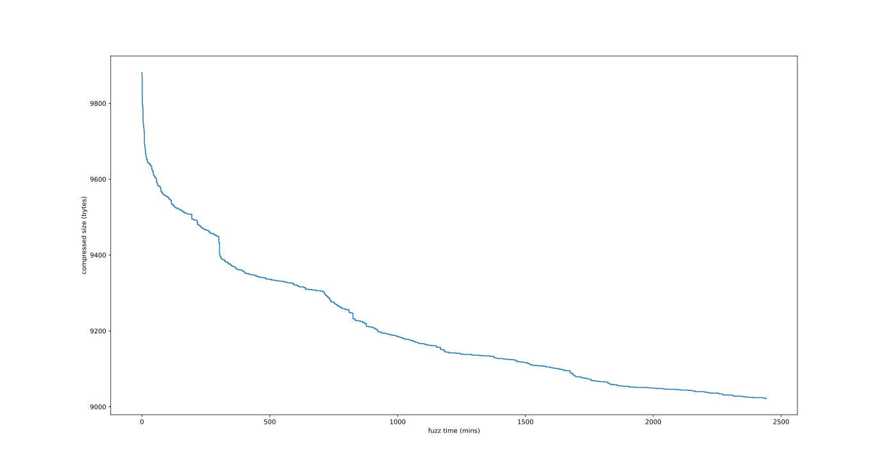
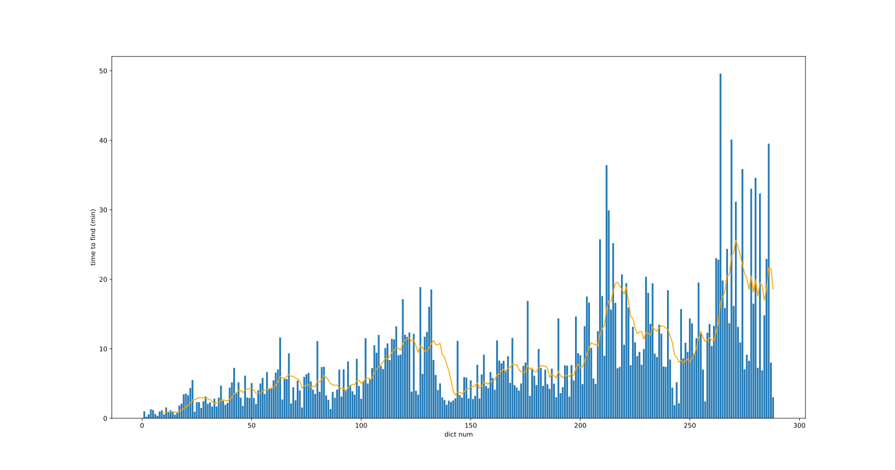

This directory contains a number of ad-hoc scripts I used to generate the zlib dictionary.

Firstly, a little about zlib dictionaries. A dictionary is just an extra byte stream consumed
without generating any output. This means we want it to contain all the most commonly used
substrings, so that the compressor can refer back to them instead of encoding new literals, with the
most common at the end for smaller jump distances. The max window size is 0x8000, so we want the
dictionary to be that big, but no longer so we don't wast time processing it.


The following files contain lists of every unique instance of the relevant class used across BL2,
TPS, and AoDK, with duplicates between games removed. These were extracted from the BLCMM data.

| File                       | Class                           |
| -------------------------- | ------------------------------- |
| `unique_balances.txt`      | `InventoryBalanceDefinition`    |
| `unique_definitions.txt`   | `WillowInventoryDefinition`     |
| `unique_manufacturers.txt` | `ManufacturerDefinition`        |
| `unique_parts.txt`         | `WillowInventoryPartDefinition` |
  

`gen_dict.py` runs some stats over `unique_parts.txt` and generates an initial dictionary. The
script seems to be a little non-deterministic (probably due to dict/set iteration order), so I saved
my results in `zdict.wip.0`. We only use part names for the dict since most slots are parts, we
expect modded items will mainly contain part replacements. We also expect modded parts to mostly
follow the naming conventions as the game, so using all the existing parts is a good collection of
training data.

`constructor_to_replacements.py` parses a constructor save file, creates the uncompressed
replacement buffers for each item, and writes them to `replacements.bin`. It uses the four `unique*`
files to check what's vanilla. I ran this over
[this exodus save file](https://www.nexusmods.com/borderlands2/mods/341) to create `exodus.bin`,
which contains 172 items. I would've liked to use a bit more data, but large modded save files are
hard to come by.

`eval.cpp`, when compiled, runs over `exodus.bin`, compresses each item's replacement list
individually, and reports the total compressed size. It takes the dictionary file as an argument, so
can be used to evaluate different dictionaries
  
This must be compiled with C++20, and linked with zlib.
```sh
> clang++ -O3 -march=native --std=c++20 -lz eval.cpp -o evaluate
> ./evaluate zdict.wip.0
zdict.wip.0: 9882/37694
```

When using clang, `eval.cpp` can also be compiled into a fuzz test. This will fuzz the dictionary,
and check if any compress to smaller than the passed `-DFUZZ_TARGET`.

```sh
> mkdir corpus
> cp zdict.wip.0 corpus/.
> clang++ -fsanitize=fuzzer -DFUZZ_TARGET=9882 -O3 -march=native --std=c++20 -lz eval.cpp -o fuzz
> ./fuzz -max_len=40000 -len_control=0 -only_ascii=1 -use_value_profile=1 -jobs=8 corpus
```

I found the fuzzer worked best by iteratively recompiling it with a lower target size each time it
found a better dictionary. It seems to help it build up a better corpus than hoping for larger jumps
in a single step. `autofuzz.py` runs this fuzz-recompile loop automatically, forever, saving all
the best encountered dictionaries along the way.

`plot_dicts.py` looks through all the wip dictionaries, plotting their compressed size against when
the dictionary file was created. This is very specific to the exact wip files I had. I used this to
try keep track of how the fuzzing was going.

In total, I left the fuzzer running for ~40 hours. I saved the final dictionary it came up with in
`zdict.wip.288`. The fuzzing gave the following results:




The graphs show pretty clearly that it was starting to plateau, taking an average ~20 minutes to
find single byte improvements.

The overall improvement was 860 bytes, or exactly 5 bytes per code (yes I stopped it at exact the
right time to get that). This is ~8.7% smaller than the original compressed size, ~2.3% better
compression (comparing against the uncompressed data), or ~6.66 b64 characters saved per code.

Ignoring the rapid improvements right at the start, there's still a decent few spots there's a
sudden drop. I checked most of these, and, as you might expect, they come from the fuzzer deciding
to make a large change. This was either copying a large block of data somewhere else in the dict, or
just deleting a large block. Sometimes one happened immediately after the other - like what you see
at 300 min/9450 bytes. The rest of the improvements mostly come from smaller shuffles which are hard
to reason about.

I don't think the final dict ended up particularly over-fit to the evaluation data. The overall
improvement was relatively small, and it didn't seemed to start to piece together strings which
appeared in the input. Any overfitting the fuzzer came up fuzzer came up with probably isn't that
much worse than what was in the input data I fed it with.

The only other change I made to the dictionary after `zdict.wip.288` was to trim off the first two
characters, bringing it to exactly 0x8000 bytes.
